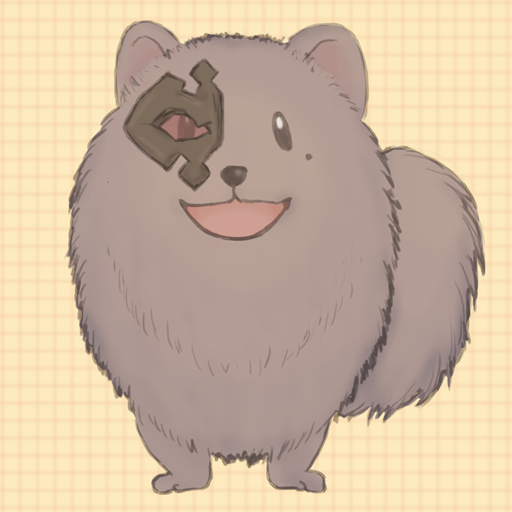

# jet_black_pomeranian

漆黒のポメラニアン団でお世話をしている犬。


# 機能

- 古戦場・ドレバラ時、色々言ってくれる
- 「ヒヒイロチャレンジ」と言えば、ヒヒイロチャレンジができる
- 「アルバハ募集」と言えば、テンプレートを置いてくれる
- 「つよ募集」と言えば、テンプレートを置いてくれる
- 「ルシ募集」と言えば、テンプレートを置いてくれる
- 「バブ募集」と言えば、テンプレートを置いてくれる
- 「ベリアル募集」と言えば、テンプレートを置いてくれる

# 実行方法

## 共通：環境変数ファイル作成

.env.sampleをコピーし、.envファイルを作成します。

.envファイルの中を見て必要なトークン・チャンネルIDなどの情報を入力してください。

## Dockerとして実行する場合（推薦）

以下のコマンドで実行

```bash
docker build -t jet_black_pomeranian ./
docker run -d --rm jet_black_pomeranian
```

## Python3がインストール済みのLinux環境で実行する場合

以下のコマンドで実行

```bash
# 必要なものをインストール
python3 -m pip install --no-cache-dir -r requirements.txt
# 必要な環境ファイルをコピー
cp schedule.yml .env ./src
# Bot実行
python3 ./src/jet_black_pomeranian.py
```

※Windowsの場合、「python3」ではなく「py3」で実行する場合もあります。
実行環境に応じて変更してください。
